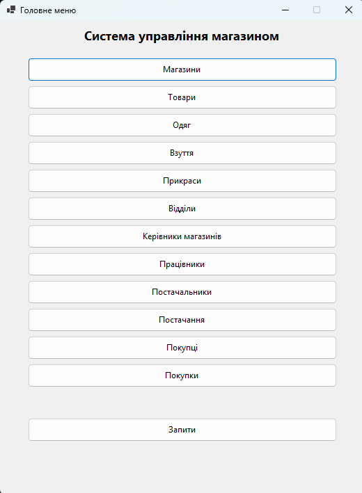
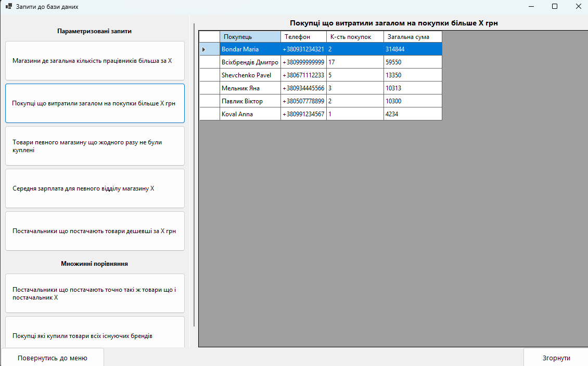
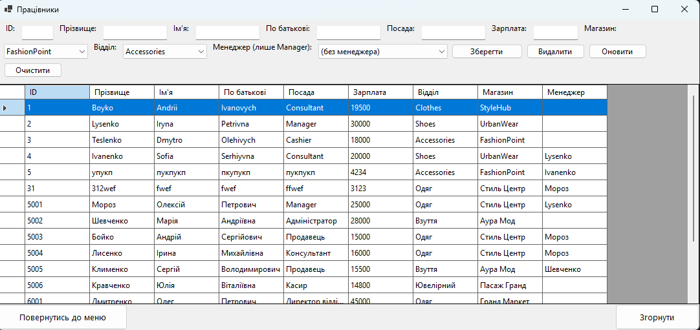

## Database Interface — Система управління магазином

Десктопний застосунок на **C# / Windows Forms** з підключенням до **PostgreSQL**.  
Розроблено як навчальний проєкт у рамках лабораторної роботи «Створення інтерфейсу користувача БД».

---

## Опис

Застосунок реалізує повноцінний графічний інтерфейс для бази даних мережі магазинів одягу.  
Дозволяє переглядати, додавати, редагувати та видаляти дані через зручні форми,  
а також виконувати аналітичні запити та переглядати звіти.

---

## Структура бази даних

База даних містить такі таблиці:

| Таблиця | Опис |
|---|---|
| `shops` | Магазини (назва, адреса, контакти) |
| `departments` | Відділи магазинів |
| `heads` | Керівники відділів |
| `workers` | Працівники (з ієрархією менеджер → підлеглий) |
| `product` | Товари |
| `clothes` | Підтип товарів — одяг |
| `shoes` | Підтип товарів — взуття |
| `jewelry` | Підтип товарів — прикраси |
| `provider` | Постачальники |
| `supply` | Постачання (постачальник → товар → магазин) |
| `customer` | Покупці |
| `purchase` | Покупки |

---

## Функціонал

### Форми (CRUD)
- **Магазини** — перегляд, додавання, редагування, видалення
- **Товари** — з прив'язкою до магазину
- **Одяг / Взуття / Прикраси** — окремі форми для кожного підтипу товарів
- **Відділи** — з прив'язкою до магазину
- **Керівники відділів**
- **Працівники** — з вибором магазину, відділу та менеджера зі списків
- **Постачальники**
- **Постачання** — зв'язок постачальник → товар → магазин
- **Покупці**
- **Покупки** — з валідацією суми та коректним видаленням за timestamp

### Запити (7 штук)

**Параметризовані (5):**
1. Магазини де загальна кількість працівників ≥ X
2. Покупці що витратили загалом більше X грн
3. Товари магазину X що жодного разу не були куплені
4. Середня зарплата у кожному відділі магазину X
5. Постачальники що постачають хоча б один товар дешевший за X грн

**Множинні порівняння (2):**

6. Постачальники що постачають **точно такий самий** набір товарів як постачальник X
7. Покупці які купили товари **всіх** існуючих брендів

> У параметризованих запитах з назвами (магазин, постачальник) — доступний як ручний ввід, так і вибір з випадаючого списку існуючих значень.

---

## Технології

- **C# / .NET** — Windows Forms
- **PostgreSQL** — база даних
- **Npgsql** — ADO.NET-провайдер для PostgreSQL
- **pgAdmin 4** — проєктування схеми БД

---

## Як запустити

### 1. Вимоги
- .NET 6+ (або .NET Framework 4.7+)
- PostgreSQL 14+
- NuGet пакет: `Npgsql`

### 2. Налаштування БД

Виконайте SQL-скрипт для створення таблиць (файл `schema.sql`).

### 3. Рядок підключення

У файлі `DbHelper.cs` знайдіть і замініть на свої дані:

```csharp
public static readonly string ConnStr =
    "Host=localhost;Port=5432;Database=shop;Username=postgres;Password=YOUR_PASSWORD";
```

### 4. Запуск

Відкрийте `Shop.sln` у Visual Studio → Build → Run.

---

## Структура проєкту

```
Shop/
├── Form1.cs                  # Головне меню
├── DbHelper.cs               # Підключення до БД, спільні методи
├── FormShops.cs              # Форма: Магазини
├── FormProducts.cs           # Форма: Товари
├── FormSubtypes.cs           # Форми: Одяг, Взуття, Прикраси
├── FormDepartmentsAndHeads.cs # Форми: Відділи, Керівники
├── FormWorkers.cs            # Форма: Працівники
├── FormOthers.cs             # Форми: Покупці, Постачальники, Постачання, Покупки
├── FormQueries.cs            # Форма: Запити (7 штук)
└── FormReports.cs            # Форма: Звіти
```

---

## Скріншоти




## Детальніший опис застосунку 

